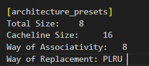

## Getting started in 30 seconds

### *Installing the package*

Typical usage  


```$  python  test.py -c ./scale.cfg```  
You can use the cfg file to configure cache parameters

### *Peculiarity*
PLRU replacement only   
Direct mapping,Set associative,Full associative  
Input data size must *smaller* than cacheline size  
No *unalign* support(data size:32bit,so addr must 4byte align)
### *Todo*
More Replacements  
Access Latency and miss Latency  
Add Memory Trace  
More test to check the correctness  

